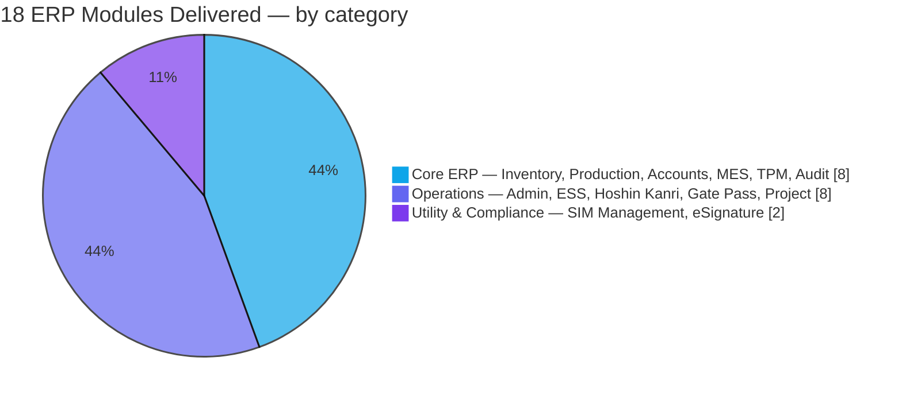
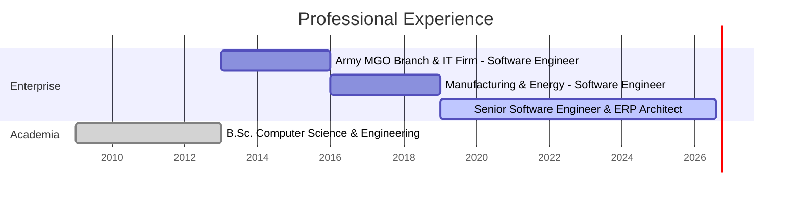

<div align="center">


[](https://mostofacse58.github.io/mostofacse58/)

<a href="https://mostofacse58.github.io/mostofacse58/"></a>
<a href="https://www.linkedin.com/in/golammostofa58/"></a>
<a href="mailto:golam.mostofa58@gmail.com"></a>
<a href="https://gtechsoft.xyz/"></a>
<a href="https://www.facebook.com/golam.mostofa51"></a>

<br/>


</div>

---

## 👨‍💻 About Me

> **"Building systems that run factories. Now building the tools that run the web."**

I'm a **Senior Software Engineer & ERP Architect** with **11+ years** architecting high-stakes enterprise systems. My career was forged in the complex operational landscapes of Bangladesh's **Army MGO Branch, Textile, IT, Energy and Leather manufacturing** industries — turning fragmented factory floors into synchronized digital ecosystems across HRMS, Payroll, Production, Finance and Costing.

My foundation is the **.NET ecosystem and SQL Server**, and I now ship production systems on **PHP Laravel, Next.js and cloud-native tooling** — including **MaatDrive**, a live business-management SaaS serving the German market.

```text
🔭  Senior Software Engineer & ERP Architect  ·  2019 → Present
     Epicor ERP implementation · 18-module custom ERP suite · MaatDrive SaaS (Germany)

🏗️  Architecting  ·  Enterprise ERP design · API architecture · N-Tier · Modular systems
🌱  Levelling up  ·  Next.js · TailwindCSS · Node.js · Cloud-native deployment
💬  Ask me about  ·  ERP systems · ASP.NET Core · SQL Server tuning · Laravel · SSRS · Epicor BAQ/BPM
🎯  Open to       ·  Enterprise ERP consulting & senior engineering roles
```

---

## 📊 What I Actually Build

GitHub's public language cards only see a fraction of my work — the majority of my engineering lives in **private enterprise repositories** behind manufacturing firewalls. Here's the honest picture of what I've delivered:



<div align="center">

**18 modules** deployed across **manufacturing, energy and government** sectors — plus a live SaaS platform and a full Epicor Kinetic rollout.

</div>

---

## 🗓️ Career Timeline



---

## 🛠️ Tech Stack

<table>
<tr><td valign="top" width="50%">

**◈ Backend & Core**


</td><td valign="top" width="50%">

**◈ Frontend & UI**


</td></tr>
<tr><td valign="top">

**◈ Databases**


</td><td valign="top">

**◈ ERP Platforms**


</td></tr>
<tr><td valign="top">

**◈ Reporting & BI**


</td><td valign="top">

**◈ DevOps & Tools**


</td></tr>
</table>

<details>
<summary><b>▶ Skill proficiency — self-assessed levels</b></summary>

<br/>

| Skill | Level | |
| :--- | :--- | ---: |
| ERP Architecture & Design | `███████████████████░` | **95%** |
| ASP.NET Core / C# / Dapper | `██████████████████░░` | **92%** |
| SQL Server / MySQL / PostgreSQL | `██████████████████░░` | **90%** |
| Power BI / SSRS / ECharts / Reporting | `█████████████████░░░` | **88%** |
| PHP / Laravel / CodeIgniter | `█████████████████░░░` | **85%** |
| Next.js / React / Bootstrap / Tailwind | `████████████████░░░░` | **82%** |
| Epicor ERP (Kinetic / BAQ / BPM) | `████████████████░░░░` | **80%** |
| Node.js / Express / MongoDB | `███████████████░░░░░` | **75%** |

</details>

---

## 📈 GitHub Statistics

> Live cards — they refresh on every page load and follow GitHub's light/dark theme automatically.

<div align="center">

<picture>
  <source media="(prefers-color-scheme: dark)" srcset="https://github-profile-summary-cards.vercel.app/api/cards/profile-details?username=mostofacse58&theme=github_dark"/>
  
</picture>

<picture>
  <source media="(prefers-color-scheme: dark)" srcset="https://github-profile-summary-cards.vercel.app/api/cards/stats?username=mostofacse58&theme=github_dark"/>
  
</picture>
<picture>
  <source media="(prefers-color-scheme: dark)" srcset="https://github-profile-summary-cards.vercel.app/api/cards/repos-per-language?username=mostofacse58&theme=github_dark"/>
  
</picture>
<picture>
  <source media="(prefers-color-scheme: dark)" srcset="https://github-profile-summary-cards.vercel.app/api/cards/most-commit-language?username=mostofacse58&theme=github_dark"/>
  
</picture>


</div>

---

## 🌐 Featured Live Product

<div align="center">

### [](https://maatdrive.com/)

**Cloud business-management platform for trade, crafts and service companies — serving the German market.**

<a href="https://maatdrive.com/"></a>
<a href="https://maatdrive.app/"></a>
<a href="https://www.linkedin.com/showcase/maatdrive/"></a>
<a href="https://www.facebook.com/Maatdrive/"></a>
<a href="https://www.instagram.com/maatdrive/"></a>


</div>

<table>
<tr><td width="50%" valign="top">

**👥 Customer Management** — full CRM to organise and grow client relationships

**🏭 Supplier Management** — streamlined vendor data and procurement

**📦 Inventory Management** — stock tracking, picking and inventory control

**📁 Project Management** — plan and execute complex jobs efficiently

</td><td width="50%" valign="top">

**🧾 Invoicing & Quotations** — auto-generated quotes, invoices and delivery notes

**📒 Accounting Prep** — bookkeeping data ready for further processing

**⏱️ Time Tracking** — employee time recording per project and task

**📊 Reports & Dashboard** — real-time business insights and analytics

</td></tr>
</table>

---

## 🏭 Enterprise Work

Production systems built for manufacturing, energy and government clients. These live in **private repositories** — source is proprietary, so the write-ups below describe architecture and scope only.

<table>
<tr>
<td width="50%" valign="top">

### ⚙️ Epicor ERP — Implementation Lead

Led the **end-to-end rollout and customisation** of [Epicor Kinetic](https://www.epicor.com/en-us/) across a manufacturing organisation — a platform used by 23,000+ companies in 150+ countries and a **Gartner® Magic Quadrant™ Leader** for three consecutive years.

`Epicor Kinetic` `Custom BAQ` `BPM` `SSRS` `Data Migration`


</td>
<td width="50%" valign="top">

### 🏢 Employee Self Service (ESS)

Internal **enterprise HR platform** letting employees manage their own workplace services digitally — cutting administrative load and raising transparency across HR operations.

`ASP.NET Core` `SQL Server` `eSignature` `SSRS`


</td>
</tr>
<tr>
<td width="50%" valign="top">

### 🧩 Custom ERP Suite — 18 Modules

A full in-house ERP suite spanning inventory, production, accounts, audit, maintenance and compliance — deployed across manufacturing, energy and government sectors.

`ASP.NET Core` `C#` `SQL Server` `Dapper` `SSRS`


</td>
<td width="50%" valign="top">

### 🛡️ Army MGO Branch — Government Systems

Government-grade **inventory, store management and reporting** systems built for the Bangladesh Army MGO Branch, alongside CRM and billing platforms for an IT firm.

`.NET` `C#` `SQL Server` `Crystal Reports`


</td>
</tr>
</table>

<details>
<summary><b>▶ Epicor ERP — full implementation scope</b></summary>

<br/>

| Area | What I Did |
| :--- | :--- |
| ⚙️ **System Implementation** | End-to-end ERP rollout across departments |
| 🔧 **Core Customisation** | Custom BAQ, BPM and UI modifications |
| 🏭 **Production Module** | Shop floor, job management and scheduling setup |
| 📦 **Inventory & WMS** | Warehouse management and stock control configuration |
| 💰 **Financial Management** | GL, AP/AR, costing and reporting setup |
| 🔗 **Supply Chain (SCM)** | Supplier portal and procurement workflows |
| 📊 **SSRS / BAQ Reports** | Custom dashboards and operational reports |
| 🔄 **Data Migration** | Legacy data mapping and clean migration |
| 👥 **User Training** | Department-wide onboarding and documentation |

</details>

<details>
<summary><b>▶ Employee Self Service (ESS) — module breakdown</b></summary>

<br/>

| Module | Description |
| :--- | :--- |
| 👤 **Employee Profile** | Personal info, documents and employee records |
| 📝 **Leave Management** | Apply, approve and track employee leave |
| ⏱️ **Attendance & Time** | Attendance monitoring and work-hour tracking |
| 💰 **Payroll Access** | Salary slips, payroll records, tax details |
| 📄 **Loan & Advance** | Request and manage employee loans/advances |
| 📊 **HR Reports** | Employee data insights and analytics |
| 🔔 **Notifications** | Alerts for approvals, HR updates and events |
| ✍️ **eSignature Integration** | Digital approvals and documentation |

</details>

<details>
<summary><b>▶ Custom ERP Suite — all 18 modules</b></summary>

<br/>

**🔶 Core ERP**

| # | Module | # | Module |
| :---: | :--- | :---: | :--- |
| 01 | 📦 Inventory Management | 02 | 🏛️ Assets Management |
| 03 | 💰 Accounts Module | 04 | 🔧 TPM Module |
| 05 | 🔍 Internal Audit Module | 06 | 🏭 Production Module |
| 07 | ⚙️ MES Module | 08 | 📋 Production Material Requisition |

**🔷 Operations & Management**

| # | Module | # | Module |
| :---: | :--- | :---: | :--- |
| 09 | 🏢 Administration Module | 10 | 🤝 Employee Support Services |
| 11 | 🎯 Hoshin Kanri Module | 12 | 📬 Courier Management |
| 13 | 🗑️ Disposal Management System | 14 | 🚪 Gate Pass System |
| 15 | 📁 Project Module | 16 | ✅ S6S Audit |

**🔹 Utility & Compliance**

| # | Module | # | Module |
| :---: | :--- | :---: | :--- |
| 17 | 📱 SIM Management System | 18 | ✍️ eSignature System |

</details>

---

## 🏢 Domain Expertise

| 🏭 Domain | 📦 Modules Built |
| :--- | :--- |
| **Army / Govt (MGO Branch)** | Inventory · Store Management · Reporting |
| **Textile & Garments** | Production · Costing · Payroll · HR |
| **Leather Manufacturing** | Raw Material · Finishing · Export Documentation |
| **Energy Sector** | Asset Management · Field Reporting |
| **IT Firm** | Project Management · Billing · CRM |

---

## 💼 Experience

| Role | Period | Focus |
| :--- | :--- | :--- |
| **Senior Software Engineer & ERP Architect** | 2019 – Present | Epicor ERP implementation · 18-module custom ERP suite · MaatDrive SaaS (Germany) · enterprise API design |
| **Software Engineer** — Manufacturing & Energy | 2016 – 2019 | ERP modules for leather, energy and textile firms — Production, Costing, HRMS, Payroll, Financial Reporting |
| **Software Engineer** — Army MGO Branch & IT Firm | 2013 – 2016 | Government inventory, store management and reporting · CRM, project management and billing systems |

<details>
<summary>▶ Detailed responsibilities & project contributions</summary>

<br/>

**Senior Software Engineer & ERP Architect** — _2019 – Present_
Leading full-cycle ERP development and architecture. Responsible for the Epicor ERP implementation, an 18-module custom ERP suite, the MaatDrive SaaS platform for the German market, and enterprise API design using ASP.NET Core, PHP Laravel, Next.js and SQL Server.
_Projects:_ Epicor Kinetic rollout · Custom ERP Suite · MaatDrive · Employee Self Service · GTechSoft

**Software Engineer — Manufacturing & Energy Sector** — _2016 – 2019_
Developed and maintained ERP modules for leather manufacturing, energy and textile companies. Key modules: Production, Costing, HRMS, Payroll and Financial Reporting on .NET and SQL Server.
_Projects:_ Production ERP · Costing · HRMS & Payroll · Financial Reporting

**Software Engineer — Army MGO Branch & IT Firm** — _2013 – 2016_
Built government-grade inventory, store management and reporting systems for the Army MGO Branch, while simultaneously developing CRM, project management and billing systems for an IT firm.
_Projects:_ Government Inventory & Store Management · Reporting Suite · CRM · Billing

</details>

---

## 🎓 Education

| Degree | Period | Focus |
| :--- | :--- | :--- |
| **B.Sc. in Computer Science & Engineering** | 2009 – 2013 | Software engineering, algorithms, database systems, OOP |
| **Higher Secondary Certificate (HSC)** — Science | 2007 – 2009 | Mathematics & Physics — graduated with distinction |

---

## 🧰 What I'm Doing

<table>
<tr><td width="50%" valign="top">

**🏗️ ERP System Development**

End-to-end enterprise resource planning systems — HRMS, Payroll, Production, Finance and Costing — designed for real factory floors.

</td><td width="50%" valign="top">

**💻 Full Stack Web Development**

Modern web platforms on .NET Core, Laravel and Next.js, from database schema to deployed UI.

</td></tr>
<tr><td width="50%" valign="top">

**💾 Database Architecture**

Schema design, stored procedures, indexing and query tuning across SQL Server, MySQL, PostgreSQL and MongoDB.

</td><td width="50%" valign="top">

**📊 Reporting & Data Analytics**

Operational reporting and dashboards with SSRS, Power BI, Apache ECharts, iTextSharp and EPPlus.

</td></tr>
</table>

---

## 🌟 Beyond Code

**Leadership:** Technical Leadership · Team Mentoring · ERP Rollout Management · Stakeholder Communication · Full SDLC

**Languages:** 🇧🇩 Bangla (Native) · 🇬🇧 English (Professional)

**Venture:** [GTechSoft](https://gtechsoft.xyz/) — my own software development practice, building lean enterprise SaaS

---

<div align="center">

## 🤝 Let's Work Together

**Open to enterprise ERP consulting and senior engineering roles.**

<a href="https://mostofacse58.github.io/mostofacse58/"></a>
<a href="https://www.linkedin.com/in/golammostofa58/"></a>
<a href="mailto:golam.mostofa58@gmail.com"></a>
<a href="https://gtechsoft.xyz/"></a>
<a href="https://www.facebook.com/golam.mostofa51"></a>

**📍** Dhaka, Bangladesh &nbsp;·&nbsp; **✉️** [golam.mostofa58@gmail.com](mailto:golam.mostofa58@gmail.com) &nbsp;·&nbsp; **🕙** GMT+6


</div>
